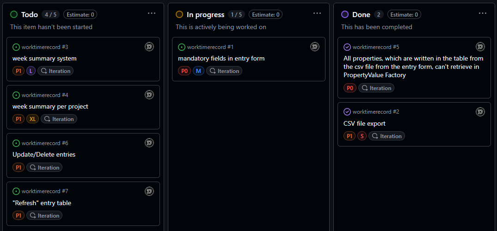

## WorkTimeRecorder

### Project description

The **WorkTimeRecorder** is a JavaFX school project, with which you can manage your working times in a company per day.
The main learning aspect is to learn how to use JavaFX and combine it with basic OOP and eventually Design patterns. 

---

### Project progress

- 2.3.2026
  - First UI design completed

- 4.3.2026
  - Basic logic
    - opening with button new ui (entry form ui)
      - clear button logic
      - save button logic
      - cancel button logic
    - Inputs from entry form ist saved into `csv/entries.csv` file
    - first worked hours save logic with class `org.httle.steiner.worktimerecord.model.WorktimeModel.java` 
      - doesn't load when application is restarted yet

- 5.3.2026
  - Entry form
    - values can be null → no NullPointerException etc.
    - worked hours getting now saved into `csv/workedhours.csv` file
      - on entry save it's getting saved into csv file
      - on application restart it's getting loaded from csv file
    - entries getting loaded from the csv file into a table view

- 6.3.2026
  - `org.httle.steiner.worktimerecord.util.Logger.java` got added
    - uses to log exceptions, application start, crashes etc.
    - Singleton pattern got used 
      - only one instance in the project
  - `csv/entries.csv` can now be exported to local datastore of user
    - File → Export in menu

- 7.3.2026
  - Changed language of UI from German to English
  - added short class description to every class what they should do
  - added a logging file to save all logs with their date and time `log/logs.log`

- 9.3.2026
  - TableView is now getting refreshed when
    - new entry is made
    - `csv/workedhours.csv` file got cleared
  - `csv/workedhours.csv` can now be cleared 
    - Menu → File → Clear entries
    - worked hours getting cleared
      - when `csv/entries.csv` is cleared
    - can now exit application
      - Menu → File → Exit
  - comments how methods and code parts worked added
    - in every class and by every method
  - Added TimeFormatter.java
  - format time from a double to mm:hh
  - format time from mm:hh to a double

---

### Project ToDos

> All project todos and issues are also documented in GitHub projects

